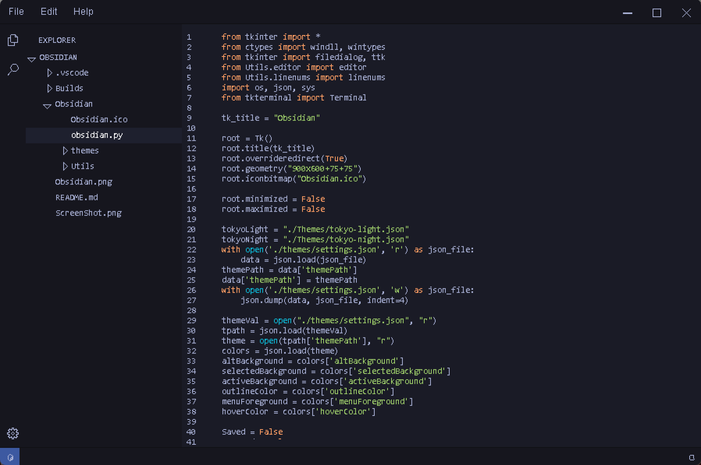
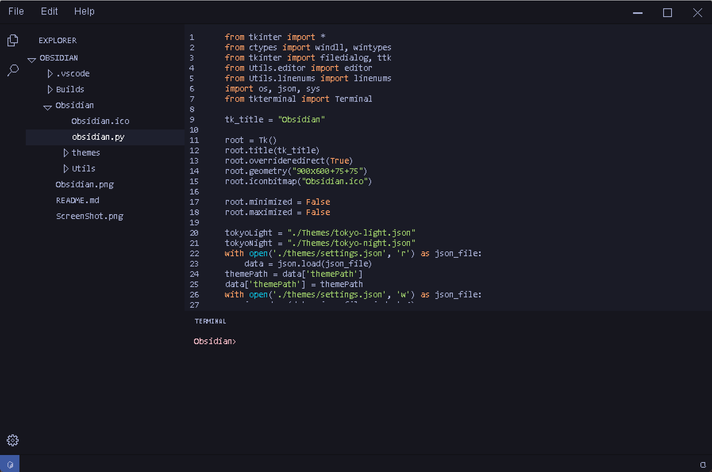

<h2 align="center">
     
</h2>

A text editor built entirely with tkinter is still in its early stage. It possesses the basic tools of text editors, and in the future, it will undergo major changes. Obsidian features syntax highlighting (currently supporting Python only), line numbers, themes, status bar and an integrated terminal. Keep an eye out for substantial enhancements and updates in the future. 

# Screenshots 📸
<h4 align="left">
     
     
     
</h4>

# Contributing 💜

The primary objective of this project aims to deliver a fully usable text editor, and would like to add more functionality to it. Obsidian is an open-source project committed to delivering a comprehensive text editor. Your valuable contributions and support play a crucial role in its development and success.
 
